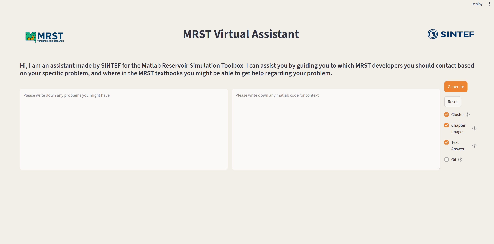

# MRST RAG Project

This is a proof-of-concept application meant to demonstrate a compentece search / guidance tool based on generativ AI using the MRST database of papers and documentation.


## Getting Started

Clone the repository by running  
```
  git clone https://github.com/aasmund-mjos-sintef/mrst-rag-project.git
```


Create a .env file in the main directory and enter  
```
  LANGCHAIN_OPENAI_API_KEY = <your_openai_api_key>  
  MRST_REPOSITORY_PATH = <full_path_to_downloaded_mrst_repository>
```  

- You can use the .env.example file as an example. Any environment variable associated with LangSmith is not needed, but can help with debugging openai_api errors or find out where and why the program does something stupid.

- It's important to download the original MRST repository if you want to use the git search. If you don't download the original MRST repository, you will get an error if you include git search in the settings. You can go to [mrst github](https://github.com/SINTEF-AppliedCompSci/MRST) to download it


You need to be on python version newer or equal to 3.13
Create a virtual environment by running  
```bash
  # Create a virtual environment in the .venv directory
  python3 -m venv .venv
  # Activate the virtual environment
  source .venv/bin/activate
```


For this project you need graphviz downloaded on your computer:  
- On Debian/Ubuntu systems run  
```bash
  sudo apt install graphviz
```   

- On Mac, you can use homebrew  
```bash
  brew install graphviz
```  


Prepare the source code package by running  
```bash
  pip install -e .
```  

## Running the Program

To run the program, navigate to the frontend folder and enter
```bash
  streamlit run app.py
```  

If everything is set up correctly, you should see the image below. However while the source code is being imported, the buttons to the right will not be visible. The first time you run the program,this will probably take a while. This is because the vector embedding models have to be downloaded on your computer. If you haven't specified the path to the mrst repository in the .env file, make sure the Git button is switched off.



## Image of Excecution Graph


